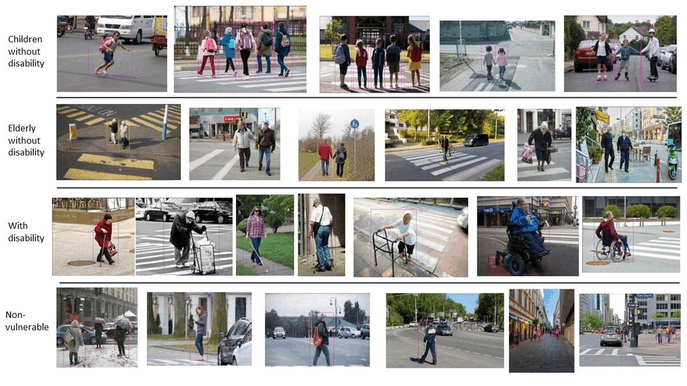

# BGVP: BG Vulnerable Pedestrian Dataset
BGVP dataset, code &amp; model weights

[Arxiv](https://arxiv.org/abs/2212.06218)

Released on December 12, 2022

## Description
The under-representation of vulnerable groups in today's pedestrian datasets points to an urgent need for a dataset of vulnerable road users.We introduce a new vulnerable pedestrian detection dataset, BG Vulnerable Pedestrian (BGVP) dataset that will serve the community and motivate more future research in this field. The dataset can also be utilized to fine-tune existing object detectors for more precise and less biased detection of vulnerable pedestrians.

This dataset contains 2,000 images with 5,932 bounding box instances from four categories, i.e., "Children Without Disability", "Elderly without Disability", "With Disability", and "Non-Vulnerable".



Train Set: 1405 Images
Validation Set: 399 Images
Test Set: 196 Images

Distriubtion of annotations among all classes.


Dataset is available in COCO JSON format. Refer to [Dataset](./Dataset/) for zipped files for each set. Refer to [Groundtruth](./Groundtruth/) for annotations. Refer to [Code](./Code/) to see implementation of training for each detector.

We trained and tested on five SOTA object detectors: YOLOv4, YOLOv5, YOLOX, Faster R-CNN, and EfficientDet. Metrics used: mAP 0.5 & mAP 0.5:0.95

## Results
Model | Backbone | Input Size | Params | GFLOPs | mAP 0.5| mAP 0.5:0.95|
------ | :------: | :------: | :------: | :------: | :------:| :------:
EfficientDet-D0 | Efficient-B0 | 512 | 3.9 M | 2.5 | 0.7048 | 0.4512  
Faster R-CNN    | Resnet-50 | 640 | 42 M | 180 | 0.7330 | 0.4860  
YOLOv4 | CSPDarknet-53 | 640 | 27.6 M | 90.2 | 0.7999 | 0.5231  
YOLOv5-s | Modified CSP v5 | 640 | 7.2 M | 16.9 | 0.7000 | 0.4800  
YOLOX-s | Modified CSP v5 | 640 | 8.94 M | 26.8 | 0.7779 | 0.561
# Cite BGVP
If you use BGVP in your research, please cite our work by using the following BibTeX entry:
```
@article{sharma2022comparison,

  title={Comparison Of Deep Object Detectors On A New Vulnerable Pedestrian Dataset},

  author={Sharma, Devansh and Hade, Tihitina and Tian, Qing},

  journal={arXiv preprint arXiv:2212.06218},

  year={2022}

}
```

# References

Models:
[YOLOX](https://github.com/Megvii-BaseDetection/YOLOX),
[YOLOv4](https://github.com/AlexeyAB/darknet),
[YOLOv5](https://github.com/ultralytics/yolov5),
[Faster R-CNN](https://github.com/facebookresearch/detectron2),
[EfficientDet](https://github.com/bubbliiiing/efficientdet-pytorch)

Annotation Tool:
[roboflow](https://roboflow.com/)

# Note 

This repository is only for non-commercial use.
